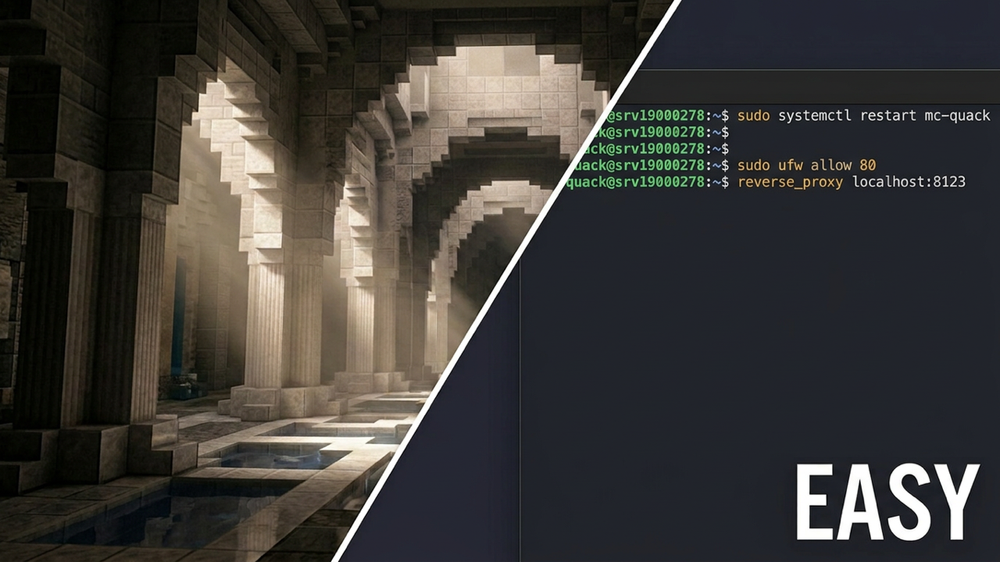

[](https://github.com/Rvhoyos/QuackedSMP/releases)

[](https://www.curseforge.com/minecraft/mc-mods/quackedsmp)
[](https://modrinth.com/mod/quackedsmp)
[](LICENSE)

# QuackedSMP

Server-side mod for **Minecraft 26.2** (Fabric + NeoForge). Claims, skills, anti-grief, custom dims, shops, hardcore, and more. Optional browser admin panel for config, backups, players, and commands.

Nothing to install on the client.

**Video tutorial** (click to watch on YouTube): install, plus Caddy, firewall, BlueMap and voice chat setup.

[](https://www.youtube.com/watch?v=fey4f_5HBtM)

## Quick Start

1. Put the Fabric or NeoForge JAR in `mods/` and start the server.
2. As OP (password at least 8 characters):
   ```
   /smp admin setpassword <your-password>
   ```
3. Open in a browser:
   - Same PC as the server: `http://localhost:8125` (or `http://127.0.0.1:8125`)
   - Other device on your network: `http://<server-ip>:8125`

The panel is optional and stays off until you set a password. Every game feature works without it.

**Before you expose the panel:**

- The admin side needs the password. The public side (metrics, chat feed, leaderboard) does not.
- The panel is plain HTTP on port 8125. Fine on localhost or a home LAN. Do not open 8125 to the internet without putting HTTPS in front of it (Caddy, Nginx) or using a private tunnel (SSH, VPN).
- Passwords are hashed, never stored as plain text. Repeated failed logins lock that IP out for a few minutes.
- Never turn the panel on in config without setting a password, unless you want anyone to have admin.

## Features

- Land claims + anti-grief
- RPG skills and abilities
- Custom dimensions and portal frames
- Chat filter and auto-mutes
- VIP tiers and kits
- Anti-xray (on by default)
- Random teleport (`/rtp`) with per-dimension profiles and arrival rewards
- In-game guide book (`/guide`) and join sidebar
- Wilderness regen, player shops, hardcore sessions, world backups, world timelapse
- Optional: Discord, BlueMap, Votifier, Spark, Simple Voice Chat

Most systems can be turned on or off in the panel **Config** tab or `config/quackedsmp.json`.

---

## Admin Panel

| Group | Tab | What you can do |
| :--- | :--- | :--- |
| **People** | Players | Online players, dimension, OP level. Grant/revoke OP, set VIP tier. |
| | Teams | Scoreboard teams, members, dimension auto-assign. |
| **World** | Dimensions | Create, delete, and configure custom dimensions. Wire portal frame blocks. |
| | Claims | View claim counts. Force-unclaim all chunks for a player. |
| | Shops | List player shops, delete shops, view bank balances, toggle economy. |
| **Gameplay** | Skills | Browse skill levels. Set level / adjust XP per skill. |
| | Hardcore | Active sessions, force-end a session. |
| | RTP | Per-dimension `/rtp` profiles: radius, biome filter, arrival effects and rewards. |
| | Kits | Build tier-gated kits, including books, enchanted gear, and coloured names. |
| | Welcome Book | Write and preview the `/guide` book page by page. |
| **Moderation** | Chat Filter | Blocked words and whitelist. Active mutes, unmute. |
| | Cmd Blocks | List, edit, and delete command blocks in loaded chunks. |
| | Commands | Run server commands from the browser and watch a live server log. Quick actions (weather, time, broadcast, end reset, wilderness regen, stop). |
| **Systems** | Mods | Upload, replace, or remove JARs in `mods/`. |
| | Backups | Create / list / download / delete world snapshots. Toggle public download. |
| | Timelapse | Capture and play back top-down world snapshots. Pick which dimensions to capture, pan/zoom a frame, export the set as a zip. |
| **Setup** | Config | Edit settings live. Most need no restart. |
| | Features | In-panel feature overview. |

The Cmd Blocks tab needs command blocks enabled on the server.

### Public dashboard

Anyone who can reach the port sees this without logging in:

- **Metrics:** RAM, disk, uptime; TPS / CPU / MSPT if Spark is installed
- **Player count**
- **Event feed:** joins, leaves, and chat
- **Skills leaderboard**
- **World download**, only if you turn on `backup_public_download`

---

<details>
<summary><strong>Feature Details</strong></summary>

### RPG Skills

12 skills in 4 categories. XP comes from normal play. Each category gives a passive buff, and each skill has an active ability you trigger yourself.

| Category | Skills | XP sources (examples) |
| :--- | :--- | :--- |
| **Industrial** | Mining, Excavation, Woodcutting | Ores, digging, logs |
| **Nature** | Farming, Fishing, Agility | Crops, fish, sprint / swim |
| **Combat** | Melee, Archery, Defense | Damage dealt, bow kills, damage taken |
| **Knowledge** | Enchanting, Alchemy, Trading | Enchanting, brewing, villager trades |

**Leveling**

Levels 1-10 cost 50 XP each. After that every level costs more than the last, up to level 100.

**Category buffs**, based on your average level in that category:

| Category | Buff | Cap at level 100 |
| :--- | :--- | :--- |
| Industrial | Movement speed | +50% |
| Nature | Max health | +10 hearts |
| Combat | Attack damage | +100% |
| Knowledge | Skill XP for your non-Knowledge skills | +100% |

**Active abilities**

Most unlock at level 10. Exceptions: Agility 3, Defense 5, Scout Zoom (Archery) 5, Trading 1. All configurable.

Buffs last about 12 seconds at unlock and up to 30 seconds at level 100. Tycoon's Charm and Scout Zoom last longer. Cooldowns shrink as the skill levels.

| Skill | Ability | Effect | Cooldown at Lv 10 | At Lv 100 |
| :--- | :--- | :--- | :--- | :--- |
| Mining | Super Breaker | Haste V | 3m | 1m |
| Excavation | Giga Drill | Haste V | 3m 45s | 1m 15s |
| Woodcutting | Tree Feller | Chain-breaks logs (max 64) | 3m 45s | 1m 15s |
| Farming | Green Terra | Bonemeals crops in 5-block radius | 2m 15s | 45s |
| Fishing | Master Angler | Luck V | 3m 45s | 1m 15s |
| Melee | Berzerk | Strength II + Speed II | 3m 45s | 1m 15s |
| Archery | Sniper | Slow Falling + Night Vision | 2m 15s | 45s |
| Archery | Scout Zoom | Spyglass zoom, mobs glow in a cone ahead | ~22s | ~7s |
| Defense | Juggernaut | Resistance IV + Slowness IV | 7m 30s | 2m 30s |
| Enchanting | Arcane Infusion | Repairs the held item a little | 15m | 5m |
| Alchemy | Philosopher's Touch | Picks up a Spawner intact | 7m 30s | 2m 30s |
| Trading | Tycoon's Charm | Hero of the Village | 15m | 5m |
| Agility | Dash | Velocity boost in the direction you look | ~7s | ~2s |

**How to trigger them**

- **Most abilities:** hold the matching tool, then Sneak + Drop (Q). You keep the item.
  - Pickaxe, shovel, axe, hoe, rod, sword, bow/crossbow, shield as listed above
  - Alchemy: hold a Book or Enchanted Book while looking at a Spawner
  - Trading: hold an Emerald
  - Arcane Infusion: hold any damaged item
- **Dash:** sprint + sneak while off the ground (sprint-jump, then sneak)
- **Scout Zoom:** Sneak + F with both hands empty. F again to cancel.

**Passive perks (examples)**

- Double drops from Industrial skills
- Bleed on melee hits, arrow recovery on kills
- Treasure Hunter (excavation), Leaf Blower (woodcutting), Auto Replant (farming)
- Extra armor from Defense, reduced fall damage from Agility

### Land Claiming

Claim chunks so untrusted players cannot build, break, or interact inside them.

| Command | Description | Permission |
| :--- | :--- | :--- |
| `/claim` | Claim current chunk (or brush grid) | Everyone |
| `/claim size <1-7>` | Claim brush size (odd sizes; resets on restart) | Everyone |
| `/unclaim` | Unclaim current chunk | Everyone |
| `/claim info` | Owned count, limit, remaining, current chunk | Everyone |
| `/claim map` | Nearby claim map in chat | Everyone |
| `/claim name <name>` | Name region, optional `[tag]` prefix and `&` colors | VIP / OP |
| `/claim tags` | List region tag icons | Everyone |
| `/claim trust <player>` | Trust player in all your claims | Everyone |
| `/claim untrust <player>` | Revoke trust | Everyone |
| `/claim trustlist` | List trusted players | Everyone |
| `/sos` | Eject untrusted players from your claims | Everyone |

`/trust`, `/untrust`, and `/trustlist` also work on their own.

**Anti-grief**, each one toggleable:

- Explosions that would damage a claim are blocked (`protect_explosions`)
- Fire cannot spread inside claims (`protect_fire_claims`)
- Fire and lava placement in the wilderness is off by default (`allow_fire_wilderness`, `allow_lava_wilderness`)
- Water cannot flow into someone else's claim
- Farmland cannot be trampled in claims or spawn (`protect_farmland`)
- Endermen cannot steal blocks from claims or spawn (`protect_enderman`)
- Armor stands, item frames, paintings, and villagers are safe in claims
- No PvP inside your own claims, and none in spawn if `spawn_no_pvp` is on

### Teleportation

All teleports have a 5 second warmup by default. Moving cancels them.

| Command | Description |
| :--- | :--- |
| `/home` | Your bed or respawn point, otherwise world spawn |
| `/spawn` | World spawn |
| `/rtp` | Random teleport, with per-dimension radius, biome filter, and arrival rewards |
| `/visit <name>` | Travel to a named region you own or are trusted in |
| `/tpr <player>` | Ask to teleport to someone |
| `/tpa accept` / `yes` / `deny` / `no` | Answer a request |

### Chat Management

- Blocks keywords, including attempts to disguise them with symbols or number swaps
- Whitelist for words that trip the filter by accident
- Repeat offenders are muted for longer each time (`mute_levels_minutes`, default 60 / 120 / 240 / 480 / 1440)
- Tip broadcasts every `message_interval` seconds (default 300)
- `/mute <player> <minutes>` and `/unmute <player>` (OP)
- Manage the lists and active mutes from the **Chat Filter** tab

### Welcome Book

`/guide` hands out an in-game book, written in the panel's **Welcome Book** tab. Kits and `/rtp` profiles can hand it out on first use, alongside any other written book, enchanted gear, or coloured item name you put in them.

New players also get a scoreboard sidebar when they join.

### World Hints

- Slime chunks give off slime particles below Y40 in the overworld
- Holding an eye of ender marks the nearest stronghold on the Locator Bar, with a distance readout

### Custom Dimensions (`/dim`)

Create dimensions at runtime, no datapack needed.

> [!IMPORTANT]
> Restart the server after creating one. Until you do, players cannot break or place blocks there.

| Type | Terrain |
| :--- | :--- |
| `overworld` | Standard overworld |
| `ether` | Floating islands, with a shared central spawn island for portals |
| `nether` | Vanilla nether |
| `end` | Vanilla end |

Ether dimensions connect to the overworld vertically. Fall off the bottom of an ether and you drop into the overworld at the same coordinates, along with anything you threw or built. Glide high enough in the overworld and you climb into the linked ether, if `etherSkyEntryEnabled` is on.

**Shaping an ether.** All of these are optional and can go in any order, `biomes` last:

| Parameter | What it changes |
| :--- | :--- |
| `radius <min> <max>` | How wide the islands are |
| `thickness <min> <max>` | How tall they are |
| `height <minY> <maxY>` | The band they float in |
| `spacing <i>` | How far apart they sit |
| `threshold <f>` | How much of the world is island vs open sky |
| `structures <true\|false>` | Whether vanilla structures generate |
| `biomes <ids>` | Which biomes to use |

```
/dim create quacksmp:sky_jungle ether threshold -0.9 radius 20 50 thickness 8 24 height 60 200 biomes minecraft:jungle
/dim create quacksmp:flatworld overworld flat minecraft:bedrock:1 minecraft:dirt:2 minecraft:grass_block:1
```

Flat layers work on `overworld` only.

**Portals.** New dimensions use a glowstone frame by default (`/dim setportal` to change). Build a nether-portal shape (2-21 wide, 3-21 tall) in a vanilla dimension and activate it with a water bucket. It works both ways, and the return portal appears the first time you go through.

| Command | Permission |
| :--- | :--- |
| `/dim create <id> <type> [params]` | OP |
| `/dim delete <id>` | OP |
| `/dim list` | Everyone |
| `/dim tp <id>` / `/dim tp <player> <id>` | OP |
| `/dim setportal <dim_id> <block_id>` | OP |
| `/dim setsky <dim_id>` / `/dim setsky clear` | OP |

### Discord

Put a webhook URL in Config to mirror joins, leaves, and chat to a Discord channel. Each is a separate toggle.

### BlueMap

Works with [BlueMap](https://modrinth.com/plugin/bluemap) if you have it installed. Turn on with `bluemap_enable`.

Shows claim outlines (different colors for normal, VIP, and OP), named regions, homes, chest shops, video pins, the world border, and spawn protection.

Naming a region with a tag picks its map icon:

```
/claim name "[shop] Emporium"
```

The tag is not part of the name, so `/visit Emporium` still works. `&` color codes work the same way. Run `/claim tags` for all 30.

Shop pins group by chunk and show item, price, owner, and stock. Icons disappear when you zoom out past `bluemap_icon_max_distance`.

### Hardcore Mode

Off by default (`hardcore_enabled`). Password-protected sessions under `/smp hardcore`.

- Sessions start at a random spot at least 1000 blocks from world center
- Joining stores your inventory, XP, and effects, then drops you in with a clean loadout
- Leaving gives your normal life back and pauses your hardcore progress. Join again with the password to pick up where you left off.
- When deaths reach `hardcore_death_percent` of the session's peak player count (default 50%), the session ends for everyone
- Dead players spectate until they leave or the session ends
- Session members can show withered hearts instead of normal ones (`hardcore_withered_hearts`)
- Entering the End as a living member brings back the dragon if it is gone. Killing it can win the session.

| Command | Description |
| :--- | :--- |
| `/smp hardcore create <name> <password>` | Create and join |
| `/smp hardcore join <name> <password>` | Join or resume |
| `/smp hardcore leave` | Leave |
| `/smp hardcore status [name]` | Status |
| `/smp hardcore list` | Active sessions |

### Kits

One kit claim per day by default (`kits.cooldownSeconds`, 86400). Kits can be locked to a VIP tier and are built in the panel. Ships with `starter` (everyone) and `vip` (tier 1).

| Command | Description |
| :--- | :--- |
| `/smp kit` / `/smp kit list` | List kits and cooldown |
| `/smp kit <name>` | Claim a kit |

### Simple Voice Chat

If you have Simple Voice Chat installed and `voicechat_enable` is on, players cannot use voice until they confirm they are 18+ with `/verify confirm`. Decline with `/verify deny`.

### End Reset

| Command | Description |
| :--- | :--- |
| `/smp end reset dragon` | Bring the dragon fight back without wiping the End |
| `/smp end reset world` | Wipe the whole End on the next restart |

### Wilderness Regen

`/smp regen` (OP) resets **unclaimed** chunks on the next shutdown, leaving a 3-chunk buffer around every claim. Confirm, cancel, or check status with subcommands, or run it from the Commands tab.

### Spawn PvP Protection

`spawn_no_pvp` (on by default) blocks PvP when either player is inside the spawn protection radius.

### Anti-XRay

`antixray_enabled` (on by default) hides ores that are completely buried, so x-ray clients see nothing but plain stone. Ores appear normally as you dig toward them.

### Player Shops

Off by default (`shops_enabled`). Look at a chest you own and run `/shop create <price> [currency] [unit]`. The chest's contents are the stock. Chests inside spawn protection become admin shops with unlimited stock.

**Economy bank** (`economy_enabled`, off by default) adds virtual emeralds you can deposit, withdraw, and transfer. Buying from shops still uses real items.

> [!WARNING]
> The economy bank is a beta feature. Enable at your own risk.

| Command | Notes |
| :--- | :--- |
| `/shop create <price> [currency] [unit]` | Create on the chest you are looking at |
| `/shop delete` / `info` / `list` | Manage and inspect |
| `/shop deposit` / `withdraw` / `transfer` / `balance` | Bank, if economy is on |

### Command Blocks

Find every command block in loaded chunks and edit or delete it from the panel. Needs command blocks enabled on the server.

### Vote Rewards (Votifier)

Reward players for voting on server lists (`votifier.enabled`, off by default, port 8192). Set the same token your list site uses. Rewards can stack by VIP tier, and votes that arrive while a player is offline are held until they return.

### World Backups

Create, download, and delete world snapshots from the panel. They go in `backup_dir` (default `backups`), and the oldest are removed past `backup_max_count` (default 5). You can optionally let players download the latest one and share the link with `/smp download`.

### World Timelapse

Off by default (`timelapse_enabled`). Every `timelapse_interval_minutes`, it saves a top-down picture of each dimension you opted into (`timelapse_dimensions`), building up a time-lapse you can play back in the panel.

Frames are full resolution, one pixel per block, and only shrink if the server is short on memory. `timelapse_max_frames` limits how many are kept per dimension (0 keeps everything). Grab one on demand with `/timelapse capture` or **Capture Now** in the panel.

</details>

---

<details>
<summary><strong>Full Command Reference</strong></summary>

| Command | Description | Permission |
| :--- | :--- | :--- |
| `/smp help` | Short command tips | Everyone |
| `/guide` | Get the server guide book | Everyone |
| `/rules` | Server rules | Everyone |
| `/home` | Bed / respawn / spawn fallback | Everyone |
| `/spawn` | World spawn | Everyone |
| `/rtp` | Random teleport | Everyone |
| `/visit <name>` | Travel to a named region | Everyone |
| `/tpr <player>` | Teleport request | Everyone |
| `/tpa accept\|yes\|deny\|no` | Answer teleport request | Everyone |
| `/claim` … / `/unclaim` / `/sos` | Claims (see Feature Details) | Everyone / VIP to name |
| `/trust` / `/untrust` / `/trustlist` | Trust list (also under `/claim`) | Everyone |
| `/skills` … | Skills overview, view, top | Everyone |
| `/shop` … | Player shops and bank | Everyone |
| `/smp kit` / `list` / `<name>` | Daily kits | Everyone |
| `/smp hardcore create\|join\|leave\|status\|list` | Hardcore sessions | Everyone |
| `/smp keepinv` / `on` / `off` | Keep inventory preference (also `/keepinv`) | Everyone |
| `/verify confirm` / `deny` | Voice chat age gate | Everyone |
| `/smp download` | Send the world download link | Everyone |
| `/dim list` | List dimensions | Everyone |
| `/smp reload` | Reload config from disk | OP |
| `/smp config` / `reset` | In-game config menu / factory reset | OP |
| `/smp admin setpassword <password>` | Set panel password and turn the panel on | OP |
| `/mute <player> <mins>` / `/unmute <player>` | Mute and unmute | OP |
| `/punish <player>` | Wipe inventory and claim items | OP |
| `/vip set\|remove\|list\|info` | VIP tiers | OP |
| `/skills givexp\|setlevel` | Adjust a player's skills | OP |
| `/dim create\|delete\|tp\|setportal\|setsky` | Custom dimensions | OP |
| `/smp end reset dragon\|world` | Reset the dragon or the End | OP |
| `/smp regen` / `confirm` / `cancel` / `status` | Wilderness regen | OP |
| `/timelapse capture` | Capture a timelapse frame now | OP |
| `/smp bluemap` | Force-refresh BlueMap markers | OP |
| `/youtube add\|remove\|list` | Video markers on the map | OP |

</details>

---

<details>
<summary><strong>Configuration Reference</strong></summary>

File: `config/quackedsmp.json`. Most values are editable from the panel's **Config** tab. Apply changes without a restart using `/smp reload`.

| Key | Default | Description |
| :--- | :--- | :--- |
| `max_claims` | `50` | Max claim chunks for a normal player |
| `tiers` | one VIP tier (1, 100h, +20 claims) | Tier definitions |
| `tp_warmup` | `5` | Teleport warmup seconds |
| `message_interval` | `300` | Seconds between tip broadcasts |
| `welcome_message` | `&6Welcome to QuackedSMP, {player}!` | Join message; supports `{player}` and `{server}` |
| `allow_lava_wilderness` | `false` | Allow lava placement outside claims |
| `allow_fire_wilderness` | `false` | Allow fire in the wilderness |
| `spawn_no_pvp` | `true` | Block PvP in spawn protection |
| `protect_explosions` | `true` | Claim explosion protection |
| `protect_fire_claims` | `true` | Fire protection inside claims |
| `protect_enderman` | `true` | Stop endermen griefing claims / spawn |
| `protect_farmland` | `true` | Farmland trampling protection |
| `claims_enabled` | `true` | Claiming system |
| `skills_enabled` | `true` | Skills system |
| `chatfilter_enabled` | `true` | Chat filter |
| `voicechat_enable` | `true` | Voice chat age gate |
| `mute_levels_minutes` | `[60,120,240,480,1440]` | Auto-mute escalation |
| `dashboard.enabled` | `false` | Panel on or off |
| `dashboard.port` | `8125` | Panel port |
| `dashboard.admin_enabled` | `false` | Admin side enabled (set by `setpassword`) |
| `dashboard.server_name` | `""` | Name shown in the panel header |
| `bluemap_enable` | `true` | BlueMap integration when installed |
| `bluemap_show_homes` | `true` | Homes on map |
| `bluemap_show_claims` | `true` | Claim outlines |
| `bluemap_claim_color` | `00FFFF` | Normal claim color |
| `bluemap_op_claim_color` | `FFD700` | OP claim color |
| `bluemap_vip_claim_color` | `8A2BE2` | VIP claim color |
| `bluemap_show_worldborder` | `true` | World border outline |
| `bluemap_worldborder_color` | `FF3C3C` | Border color |
| `bluemap_show_shops` | `true` | Chest shops on map |
| `bluemap_show_youtube` | `true` | Video pins on map |
| `bluemap_icon_max_distance` | `2000` | Hide icons past this zoom distance (0 = never) |
| `bluemap_show_spawn_protection` | `true` | Spawn protection outline |
| `bluemap_spawn_protection_color` | `80409040` | Spawn outline color |
| `antixray_enabled` | `true` | Hide buried ores |
| `shops_enabled` | `false` | `/shop` |
| `economy_enabled` | `false` | Emerald bank (beta) |
| `backup_max_count` | `5` | How many snapshots to keep |
| `backup_dir` | `"backups"` | Snapshot folder |
| `backup_public_download` | `false` | Let players download the latest snapshot |
| `backup_public_max_per_ip` | `2` | Downloads at once per player |
| `backup_public_max_concurrent` | `0` | Downloads at once total (`0` = your max-players) |
| `panel_url` | `""` | Public panel URL used by `/smp download` |
| `panel_message` | see JSON | Chat template; `{url}` is replaced |
| `panel_message_enabled` | `false` | Broadcast the panel link periodically |
| `panel_message_interval` | `1800` | Seconds between those broadcasts |
| `votifier.enabled` | `false` | Vote listener |
| `votifier.port` | `8192` | Vote port |
| `votifier.token` | `""` | Token shared with your server list |
| `votifier.broadcast` | see JSON | Vote chat line |
| `kits_enabled` | `true` | Kit system |
| `kits.cooldownSeconds` | `86400` | Time between kit claims |
| `kits.kits` | starter + vip | Kit definitions |
| `hardcore_enabled` | `false` | Hardcore sessions |
| `hardcore_death_percent` | `50` | Deaths vs peak players before a session ends |
| `hardcore_withered_hearts` | `true` | Withered hearts for session members |
| `timelapse_enabled` | `false` | World timelapse |
| `timelapse_dimensions` | `["minecraft:overworld"]` | Which dimensions to capture |
| `timelapse_interval_minutes` | `60` | Minutes between captures |
| `timelapse_max_frames` | `0` | Frames kept per dimension (0 = all) |
| `timelapse_dir` | `"timelapse"` | Frame folder |
| `team_auto_assign` | `{}` | Team name to dimension IDs |
| `skills.xp_exponent` | `1.5` | How fast levels get expensive |
| `skills.ability_unlock_levels` | see JSON | Per-ability unlock levels |
| `skills.cooldowns` | see JSON | Base ability cooldowns (seconds) |
| `skills.caps` | see JSON | Category buff limits |

**Category buff limits at level 100**

| Key | Default | Effect at the cap |
| :--- | :--- | :--- |
| `industrial_speed` | `0.5` | +50% movement speed |
| `nature_health` | `10.0` | +10 hearts |
| `combat_damage` | `1.0` | +100% attack damage |
| `knowledge_xp` | `1.0` | +100% skill XP for non-Knowledge skills |
| `double_drop` | `0.5` | 50% chance of double drops |
| `defense_armor` | `10.0` | +10 armor |
| `safe_landing` | `1.0` | All fall damage absorbed |

</details>

---

## License

Copyright (c) 2025 QuackedSMP. All Rights Reserved.

You may use this mod on your Minecraft server. You may not redistribute, repackage, or publish it as your own.
